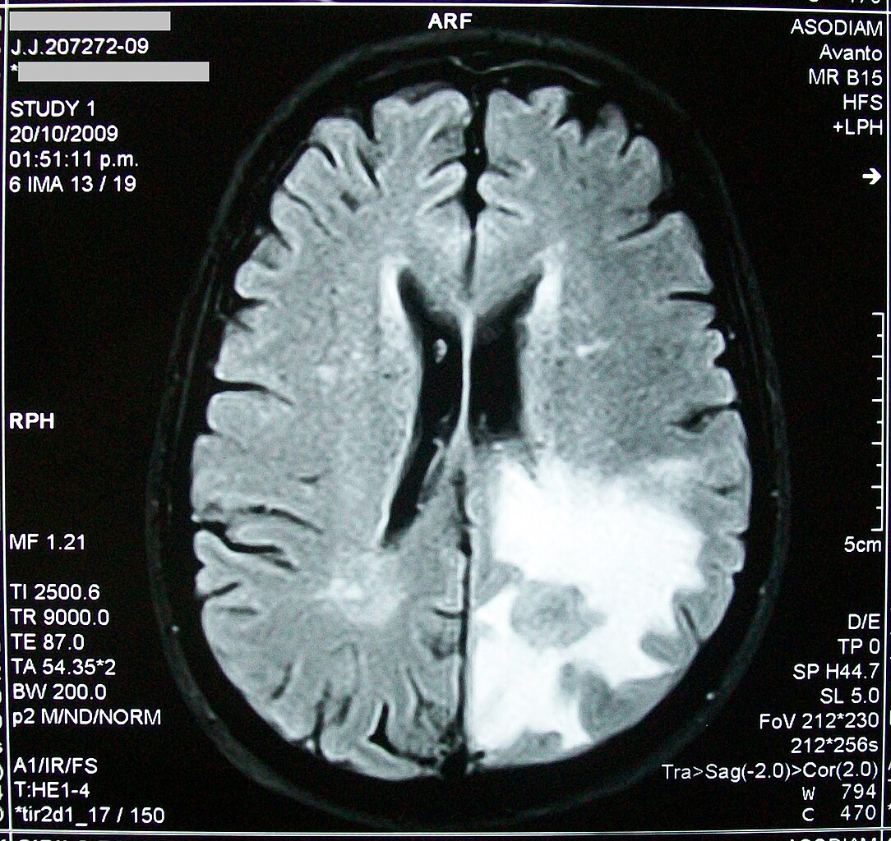

# Brain Tumor Detection

This project leverages computer vision techniques to detect and classify brain tumors from MRI scans. The workflow includes data augmentation, model training, and applying transfer learning using pre-trained models.

## Requirements

- GPU
- Jupyter Notebook

## Notebook

All steps and code are available in the `brain_tumor_detection.ipynb` notebook.

## Workflow

1. **Data Augmentation**: Enhance the dataset with various transformations to improve model robustness.
2. **Train-Test Split**: Divide the dataset into training and testing sets.
3. **Build Naive Baseline CNN**: Develop and train a basic Convolutional Neural Network as a baseline model.
4. **Transfer-learning using ResNet50**: Apply transfer learning using the ResNet50 architecture to improve performance.
5. **Transfer-learning using EfficientNet**: Further enhance the model using EfficientNet for better accuracy.

## Development Status

Development is currently in progress!

## How to Run

1. Clone this repository.
2. Install the required packages.
3. Open the `brain_tumor_detection.ipynb` notebook.
4. Follow the steps outlined in the notebook to run the project.

## License

This project is licensed under the MIT License. See the `LICENSE` file for more details.

